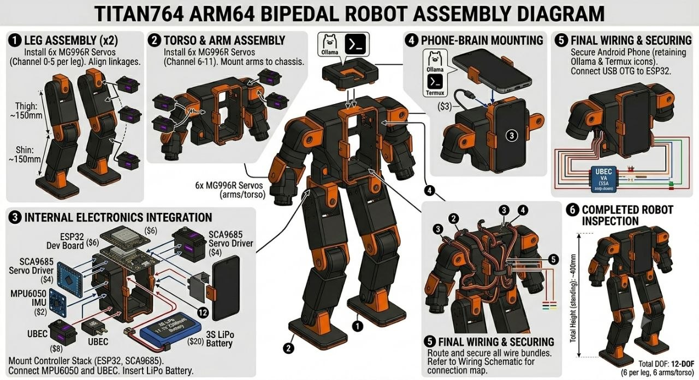
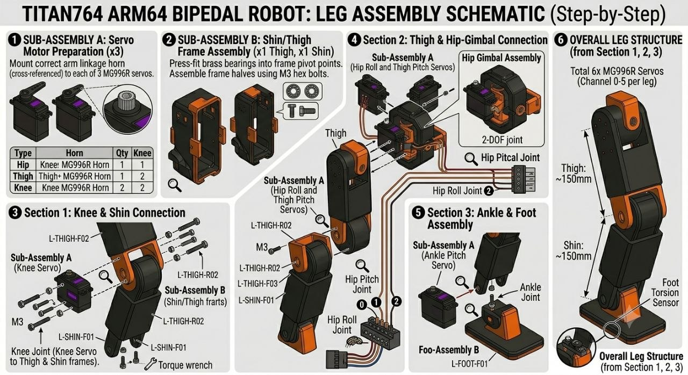
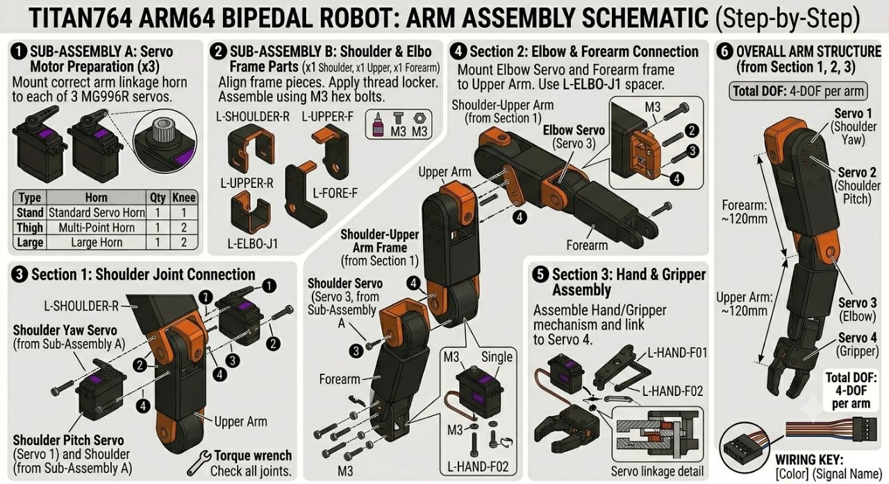

# TITAN-7 ARM64

[](https://www.python.org/)
[](https://docs.micropython.org/)
[](https://termux.com/)
[](https://shizuku.rikka.app)
[](https://en.wikipedia.org/wiki/Servo_(radio_control))

Phone-brain bipedal robot. Runs on arm64 Android through Termux + Shizuku. The phone reads IMU sensors, runs a 0.5B LLM for gait decisions, and sends serial commands to an ESP32 that drives 12 MG996R servos via PCA9685.

## Architecture


```
[Android Phone]
  Termux + Shizuku
  termux-sensor (IMU) + Ollama(Qwen2.5:0.5B)
  USB OTG
      ▼
[ESP32]
  esp32_main.py (MicroPython)
  PCA9685 (12× MG996R)
```

**Phone responsibilities:**
- Sensor fusion from accelerometer + gyroscope
- LLM intent decisions (~80–150ms, 1–2s interval)
- Serial command transport to ESP32

**ESP32 responsibilities:**
- 50Hz PID gait control
- Safe servo command execution
- Real-time balance and walking primitives

## Hardware Bill of Materials

| Component | Qty | Notes |
|-----------|-----|-------|
| ESP32 DEVKIT V1 | 1 | Main MCU |
| MG996R metal-gear servo | 12 | 6 per leg |
| PCA9685 16ch servo driver | 1 | I2C → 0x40 |
| 3S LiPo 11.1V 2200mAh | 1 | Robot power |
| UBEC 5V 20A step-down | 1 | Peak ~15A stall |
| MPU6050 IMU | 1 | Optional backup IMU on body |
| USB OTG cable | 1 | Phone → ESP32 serial |
| 3D-printed chassis | 1 | PETG/PLA |

**Estimated build cost:** ~$118–130

## Hardware & Assembly







## Wiring

```
Phone (USB OTG) → ESP32 UART0 @ 115200 baud [Serial]

ESP32 I2C → PCA9685 @ 0x40
  PCA9685 channels 0-5 → right leg
  PCA9685 channels 6-11 → left leg
  PCA9685 channels 12-13 → pelvis
  PCA9685 channels 14-15 → torso
  PCA9685 V+ → UBEC 5V output
  PCA9685 GND → ESP32 GND + UBEC GND

MPU6050 I2C → ESP32 (optional)
  VCC → 3.3V
  GND → GND
  SDA → GPIO21
  SCL → GPIO22
```

## Servo Map

| Channel | Joint | Leg/Side |
|---------|-------|----------|
| 0 | Hip Yaw | Right |
| 1 | Hip Roll | Right |
| 2 | Hip Pitch | Right |
| 3 | Knee Pitch | Right |
| 4 | Ankle Pitch | Right |
| 5 | Ankle Roll | Right |
| 6 | Hip Yaw | Left |
| 7 | Hip Roll | Left |
| 8 | Hip Pitch | Left |
| 9 | Knee Pitch | Left |
| 10 | Ankle Pitch | Left |
| 11 | Ankle Roll | Left |
| 12 | Pelvis Yaw | Pelvis |
| 13 | Pelvis Roll | Pelvis |
| 14 | Neck Pitch | Torso |
| 15 | Waist Yaw | Torso |

## Quick Start

```bash
git clone https://github.com/tmrisdaone/titan-7arm64.git
cd titan-7arm64
chmod +x setup.sh
./setup.sh
```

### Prerequisites
- Termux from F-Droid
- Shizuku installed and running
- USB OTG cable
- ESP32 flashed with `microcontroller/esp32_main.py`

### Flash ESP32
```bash
mpremote connect /dev/ttyUSB* mount microcontroller/esp32_main.py:/main.py
```

### Run the brain
```bash
python3 brain/main.py
```

## Safety Warning

⚠️ **This robot uses 12 high-torque servos powered by an 11.1V LiPo battery.**
- Always power off before adjusting servos
- Use the UBEC; do not power servos from ESP32 5V pin
- Secure the robot before first power-on
- Keep a kill switch / battery disconnect accessible

## Project Structure

```
titan-7arm64/
├── README.md
├── setup.sh
├── brain/
│   └── main.py
├── microcontroller/
│   └── esp32_main.py
└── docs/
    ├── blueprint.md
    └── hardware_assembly.md
```

## Contributing

1. Fork the repository
2. Create a feature branch from `main`
3. Run tests before submitting
4. Open a pull request with a clear description

## License

MIT

---

Built to ship from Termux.
